## This paper as well as Heterogeneous window transformer for image denoising is conducted by Chunwei Tian, Menghua Zheng,  Chia-Wen Lin, Zhiwu Li, David Zhang. It is accepted by the IEEE Transactions on Systems, Man, and Cybernetics: Systems. 2024. (Accepted).


## Its abstract is shown as follows.

## Deep networks can usually depend on extracting more structural information to improve denoising results. However, they may ignore correlation between pixels from an image to pursue better denoising performance. Window transformer can use long- and short-distance modeling to interact pixels to address mentioned problem. To make a tradeoff between distance modeling and denoising time, we propose a heterogeneous window transformer (HWformer) for image denoising. HWformer first designs heterogeneous global windows to capture global context information for improving denoising effects. To build a bridge between long and short-distance modeling, global windows are horizontally and vertically shifted to facilitate diversified information without increasing denoising time. To prevent the information loss phenomenon of independent patches, sparse idea is guided a feed-forward network to extract local information of neighboring patches. The proposed HWformer only takes 30% of popular Restormer in terms of denoising time.

## Requirements (Pytorch)

#### Pytorch 1.10.2

#### Python 3.8

#### openCv for Python

## DataSet

### Training datasets

#### The training dataset of the CBSD500 images is downloaded at https://pan.baidu.com/s/1ou2mK5JUh-K8iMu8-DMcMw (baiduyun) or https://drive.google.com/open?id=1S1_QrP-fIXeFl5hYY193lr07KyZV8X8r (google drive)

#### The training dataset of the DIV2K can be obtained at https://data.vision.ee.ethz.ch/cvl/DIV2K/

#### The training dataset of the Flickr2K can be obtained at http://cv.snu.ac.kr/research/EDSR/Flickr2K.tar

#### The training dataset of the WED can be obtained at https://ece.uwaterloo.ca/~k29ma/exploration/

#### Test dataset of BSD68 is downloaded at https://drive.google.com/file/d/1_fw6EKne--LVnW0mo68RrIY-j6BKPdSp/view?usp=sharing (google drive)

#### Test dataset of Set12 is downloaded at https://drive.google.com/file/d/1cpQwFpNv1MXsM5bJkIumYfww8EPtlkWf/view?usp=sharing (google drive)

#### Test dataset of CBSD68 is downloaded at https://drive.google.com/file/d/1lxXQ_buMll_JVWxKpk5fp0jduW5F_MHe/view?usp=sharing (google drive)

#### Test dataset of Kodak24 is downloaded at https://drive.google.com/file/d/1F4_mv4oTXhiG-zyG9DI4OO05KqvEKhs9/view?usp=sharing (google drive)

#### The training dataset of real noisy images is downloaded at https://drive.google.com/file/d/1IYkR4zi76p7O5OCevC11VaQeKx0r1GyT/view?usp=sharing and https://drive.google.com/file/d/19MA-Rgfc89sW9GJHpj_QedFyo-uoS8o7/view?usp=sharing （google drive）

#### The test dataset of real noisy images is downloaded at https://drive.google.com/file/d/17DE-SV85Slu2foC0F0Ftob5VmRrHWI2h/view?usp=sharing (google drive)


## Command

### Test

Download model file at https://pan.baidu.com/s/1NkQRIRydmH3ADBJBbVnGAA (passwd: a9es)

cd main

#### Gray noisy images

python trian.py --mode test --model_name bformer --rgb_range 1 --n_colors 1 --sigma 25 --num_layers 1 --n_GPUs 1 --GPU_id 3 --test_dataset Set12 --model_file_name ../model_zoo/bformer/g25/model_sigma25.pth

#### Color noisy images

python trian.py --mode test --model_name bformer --rgb_range 1 --n_colors 3 --sigma 25 --num_layers 1 --n_GPUs 1 --GPU_id 3 --test_dataset CBSD68 --model_file_name ../model_zoo/bformer/c25/model_sigma25.pth

### Train

cd main

python trian.py --mode train --n_pat_per_image 1 --batch_size 8 --model_name bformer --lr 0.0001 --rgb_range 1 --n_colors 1 --sigma 25 --patch_size 96 --patch_dim 3 --num_heads 9 --num_layers 8 --GPU_id 3

## 1. Network architecture of HWformer.

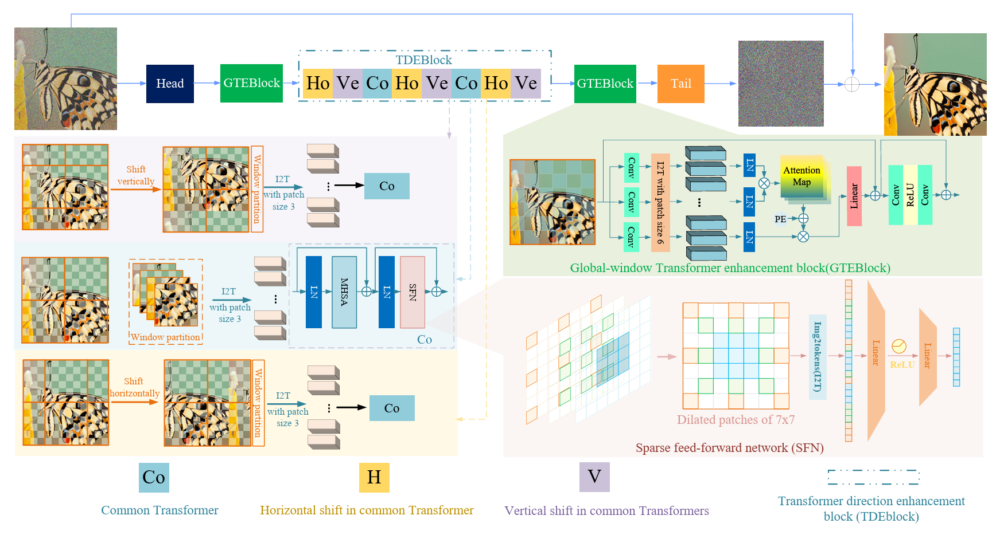

## 2. Average PSNR(dB) of different gray image denoising methods on Set12 with different noise levels of 15, 25 and 50.

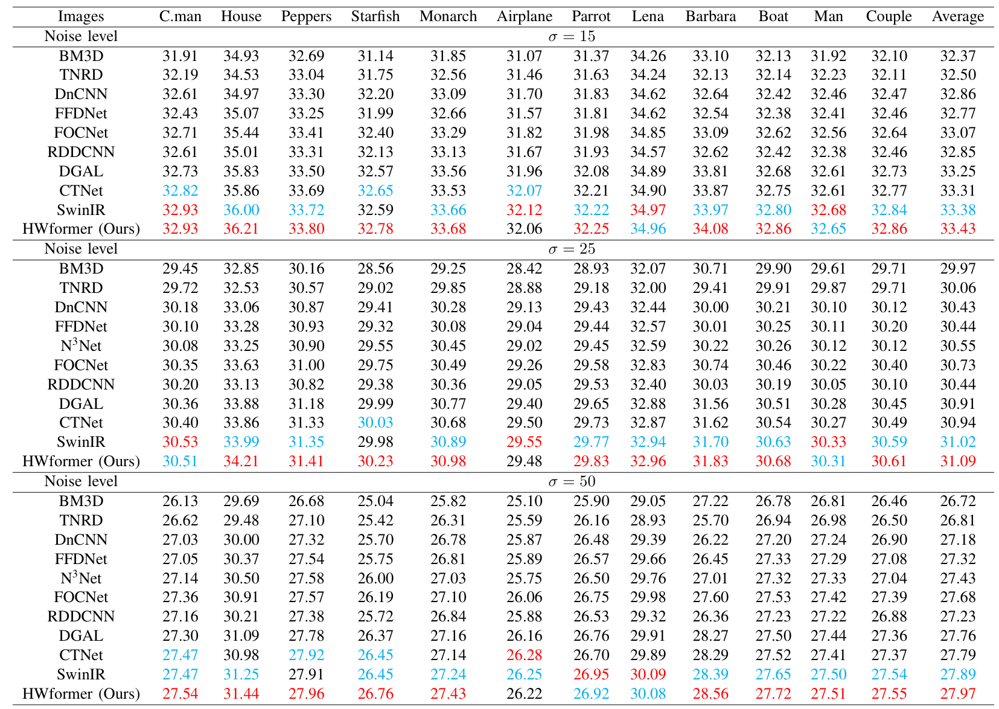

## 3. Average PSNR(dB) of different gray image denoising methods on BSD68 and Urban100 with different noise levels of 15, 25 and 50.

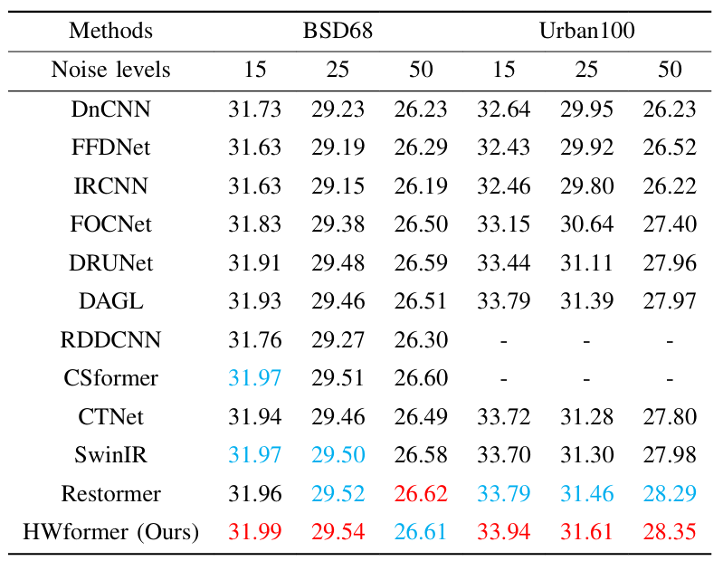

## 4. Average PSNR(dB) and LPIPS of different color image denoising methods on McMaster and Urban100 with different noise levels of 15, 25 and 50.

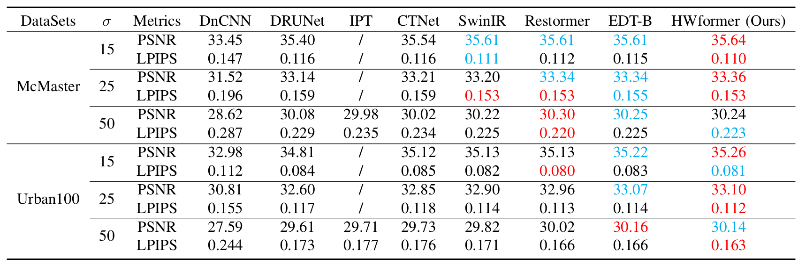

## 5. Average SSIM and FSIM of different color image denoising methods on CBSD68, Kodak24 with different noise levels of 15, 25 and 50.  

## 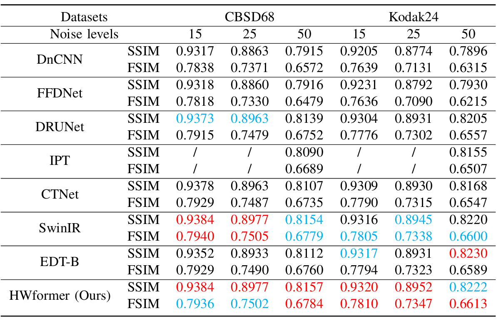

## 6. Average PSBR of different color iamge denoising methods on Urban100 with different noise levels of  15, 25 and 50.

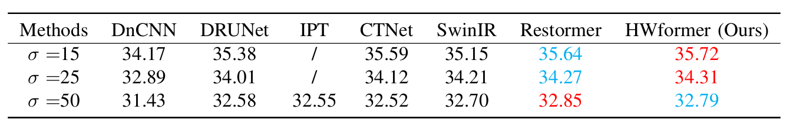

## 7. Average color difference of different color image denoising methods on McMaster with difference noise level of 15, 25 and 50. 

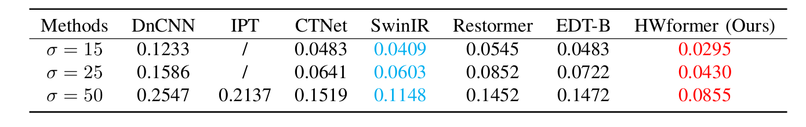

### 8. Average PSNR(dB) of differnent color image denoising methods on SPARCS with differnent noise levels of 15, 25 and 50.

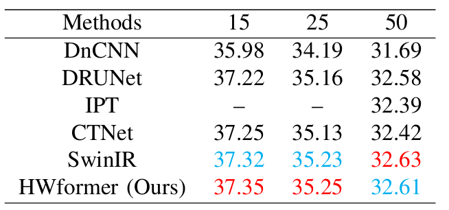

### 9. PSNR(dB) results of different methods on CC.

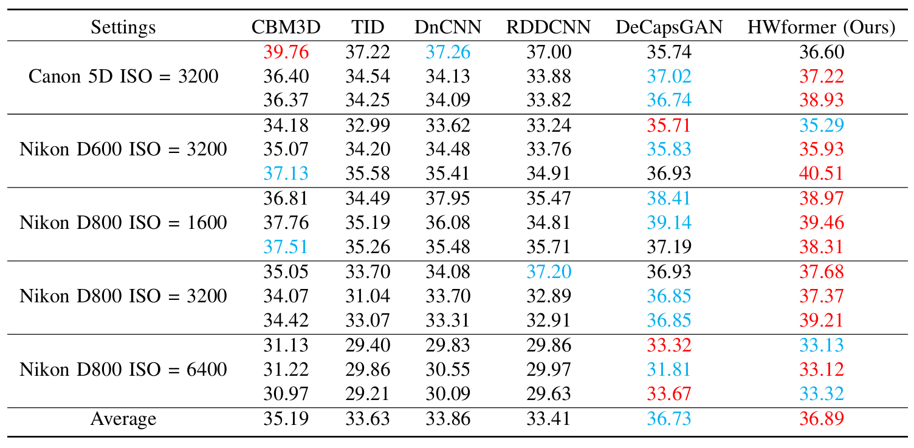

## 10. PSNR(dB) results of different methods on SIDD.

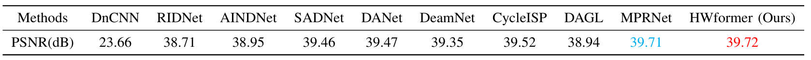

## 11. Visual results of Urban100 with noise level of 50.

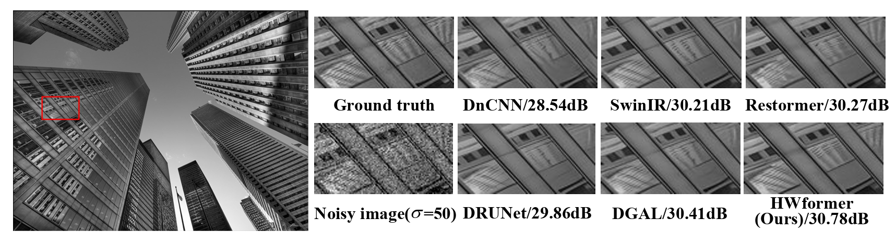

## 12. Visual results of Urban100 with noise level of 50.

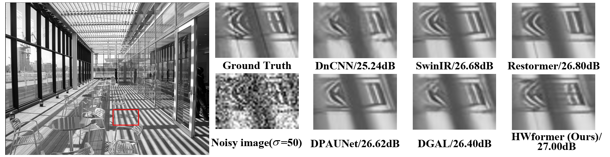

### 13. Visual results of Urban100 with noise level of 50.

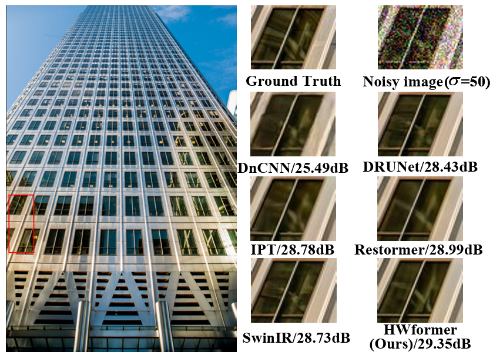

### 14. Visual results of Urban100 with noise level of 50.

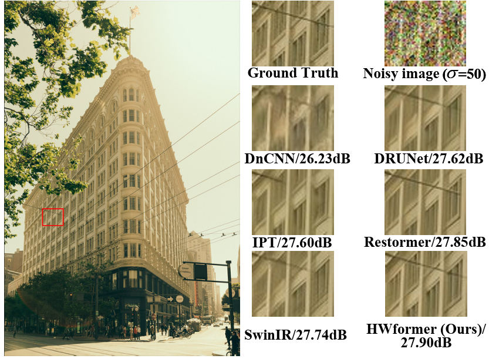

## You can cite this paper by the following ways.

### 1. Chunwei Tian, Menghua Zheng, Chia-Wen Lin, Zhiwu Li, David Zhang. Heterogeneous window transformer for image denoising[J]. IEEE Transactions on Systems, Man, and Cybernetics. 2024.

### 2. BibTeX style format.
```BibTeX
@article{tian2024heterogeneous,
  title={Heterogeneous window transformer for image denoising},
  author={Tian, Chunwei and Zheng, Menghua and Lin, Chia-Wen and Li, Zhiwu and Zhang, David},
  journal={IEEE Transactions on Systems, Man, and Cybernetics: Systems},
  year={2024},
  publisher={IEEE}
}
```

